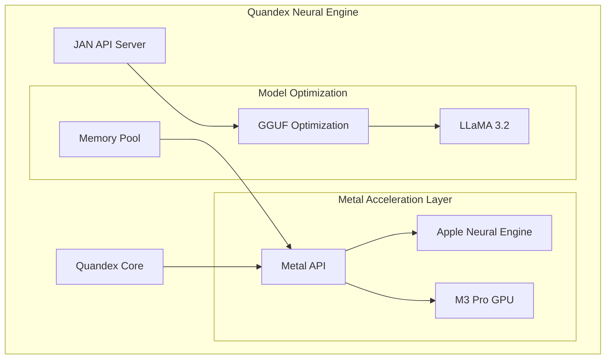
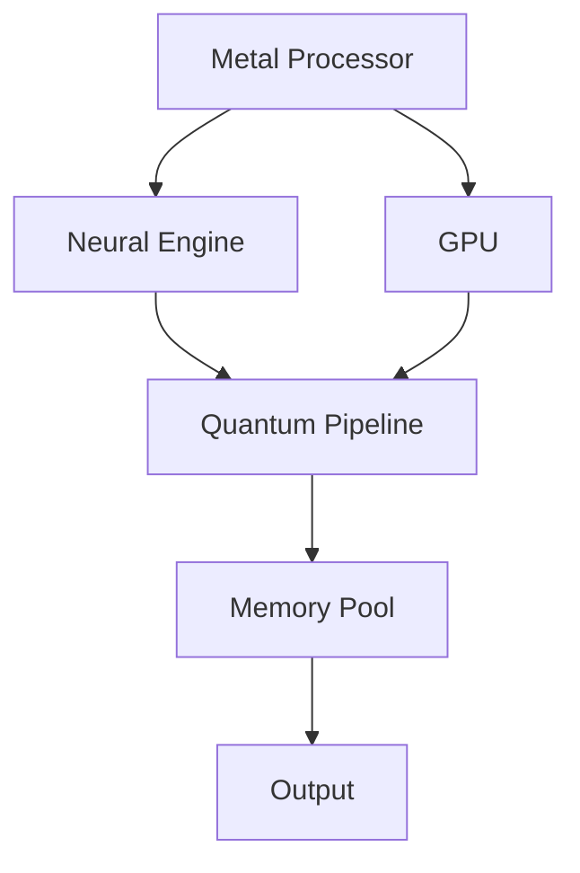
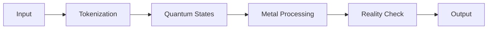
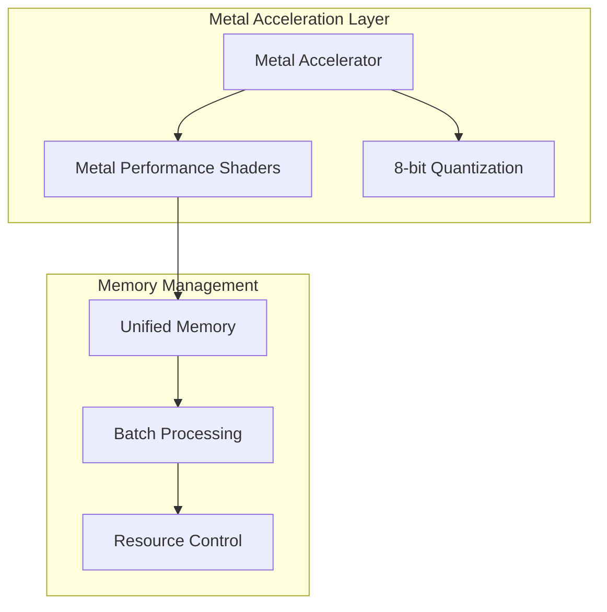
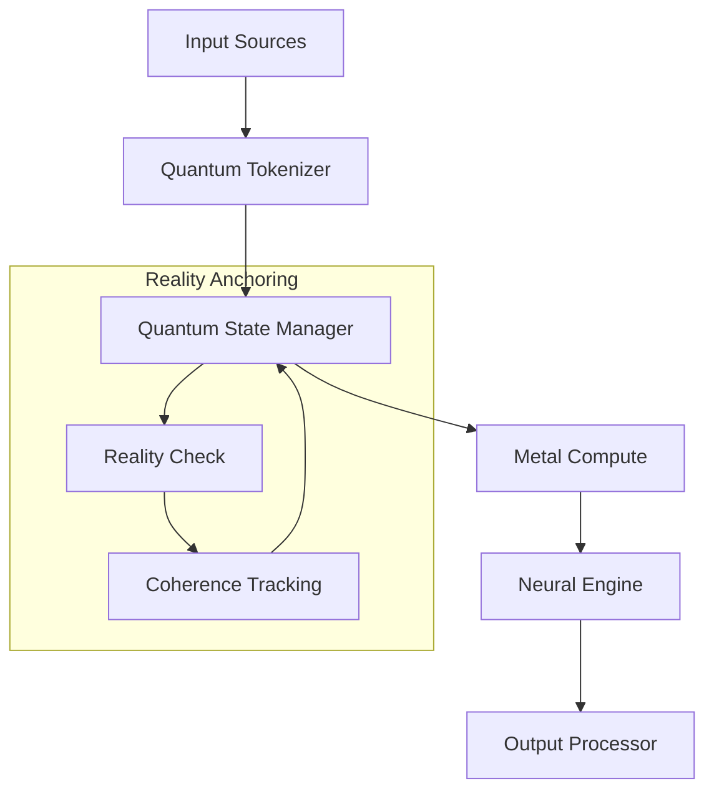

# Quandex Neural Engine Architecture

## System Overview



## Core Components

### 1. Quandex Neural Engine
The Quandex Neural Engine is a high-performance neural processing system optimized for Apple Silicon M3:

- **Metal Acceleration**: Direct integration with M3's Neural Engine
- **Model Optimization**: GGUF format optimization for LLaMA 3.2 and future models
- **Dynamic Memory Management**: Unified memory architecture optimization

### 2. JAN API Server
JSON Agentic Neural (JAN) server provides the interface for model deployment and inference:

```python
class JANServer:
    def __init__(self):
        self.metal_device = MetalDevice()
        self.model_manager = GGUFModelManager()
        
    async def process_request(self, request):
        # Process through Metal-optimized pipeline
        return await self.model_manager.infer(
            request,
            accelerator=self.metal_device
        )
```

### 3. Metal Integration
Metal Performance Shaders (MPS) optimization for neural processing:

```metal
kernel void neural_process(
    device const half4* weights [[buffer(0)]],
    device const half4* input [[buffer(1)]],
    device half4* output [[buffer(2)]],
    uint thread_id [[thread_position_in_grid]]
) {
    // M3 Pro optimized processing
    half4 input_state = input[thread_id];
    output[thread_id] = mix(input_state, weights[thread_id], 0.5h);
}
```

### 4. Metal Acceleration Layer


#### Key Features
- Direct M3 Neural Engine integration
- Metal Performance Shaders (MPS)
- 8-bit quantization
- Dynamic batch processing
- Unified memory management

### 5. Quantum-Inspired Processing

#### State Management
```python
class QuantumState:
    def __init__(self):
        self.amplitude: float
        self.phase: float
        self.entangled_states: List[int]
```

#### Reality Metrics
- Token coherence
- Context stability
- Hallucination detection
- Pattern validation

### 6. Model Architecture

#### Core Models
- **Code Understanding**: microsoft/codebert-base
  - Priority: MEDIUM
  - Use: Code analysis, documentation
  
- **State Tracking**: facebook/opt-350m
  - Priority: LOW
  - Use: Context maintenance
  
- **Decision Making**: google/flan-t5-small
  - Priority: HIGH
  - Use: Logic flows, architecture

#### Integration Models
- **LLMs**: 
  - Claude 3 Series
  - GPT-4 Series
  - Mistral 7B
- **Embeddings**: 
  - BAAI/bge-small-en-v1.5
  - OpenAI ada-002

### 7. Memory Management

#### Quantum Memory Pool
```python
class QuantumMemoryPool:
    states: List[QuantumState]
    gates: List[np.ndarray]
    ref_count: int
```

#### Features
- Dynamic allocation
- State persistence
- Garbage collection
- Memory pressure monitoring

### 8. Metal Optimization

#### Shader Implementation
```metal
kernel void quantum_circuit(
    device const Complex* input,
    device Complex* output,
    device const float4x4* gates,
    uint index
) {
    // Quantum circuit simulation
    Complex in = input[index];
    float4x4 gate = gates[index/4];
    float4 state = float4(in.real, in.imag, 0, 0);
    state = gate * state;
    output[index] = Complex(state.x, state.y);
}
```

#### Optimization Features
- Thread group optimization
- Shared memory usage
- Half-precision computation
- Batch processing
- Dynamic quantization

### 9. Pipeline Integration

#### Data Flow


#### Processing Steps
1. Input tokenization
2. Quantum state creation
3. Metal-accelerated processing
4. Reality metric calculation
5. Output generation

### 10. Reality Anchoring

#### Metrics System
```python
class RealityMetrics:
    token_confidence: float
    context_coherence: float
    retrieval_relevance: float
    human_trust: float
    warning_flags: int
```

#### Validation Process
1. Pattern matching
2. Context verification
3. Coherence checking
4. Trust scoring

## Model Support

### 1. LLaMA 3.2 Integration
- Metal-optimized inference
- Dynamic batch processing
- Adaptive memory management

### 2. Future Model Support
- Mistral AI models
- Claude 3
- GPT-4 Turbo
- Custom fine-tuned models

## Model Architecture

### Core Language Models

#### 1. Large Language Models
- **Anthropic Models**
  - Claude 3 Opus (claude-3-opus-20240229)
  - Claude 3 Sonnet (claude-3-sonnet-20240229)
  - Claude 3.5 Sonnet (claude-3-5-sonnet-20240620)
  - Claude 3 Haiku (claude-3-haiku-20240307)

- **OpenAI Models**
  - GPT-3.5 Series
  - GPT-4 Series (including vision and turbo variants)
  - Text Embedding Models (ada-002, v3-small, v3-large)

- **Local Models**
  - Mistral 7B Instruct (via Llamafile)

#### 2. Specialized Models
- **Code Understanding**: microsoft/codebert-base (Priority: MEDIUM)
  - Purpose: Code analysis, documentation, refactoring
  - Use Cases: Understanding code structure, suggesting improvements

- **State Tracking**: facebook/opt-350m (Priority: LOW)
  - Purpose: Context maintenance, variable tracking
  - Use Cases: Program state monitoring, execution flow tracking

- **Decision Making**: google/flan-t5-small (Priority: HIGH)
  - Purpose: Logic flows, architectural decisions
  - Use Cases: Solution optimization, complex problem solving

### Metal Acceleration Integration



#### Metal Optimization Features
1. **Hardware Acceleration**
   - Direct M3 Neural Engine integration
   - Metal Performance Shaders (MPS) for tensor operations
   - Dynamic batch size adjustment

2. **Memory Optimization**
   - 8-bit quantization for efficiency
   - Unified memory management
   - Resource priority levels (LOW, MEDIUM, HIGH)

3. **Performance Features**
   - Batch size: 32
   - Max sequence length: 2048
   - Custom shader compilation
   - Async processing support

### RAG Integration

The system uses BAAI/bge-small-en-v1.5 as the default embedding model, with the following features:
- Metal-accelerated embedding generation
- Milvus vector store integration
- Reality metrics for result validation

### Model Selection Logic

```python
model_configs = {
    "code_understanding": ("microsoft/codebert-base", ResourcePriority.MEDIUM),
    "state_tracking": ("facebook/opt-350m", ResourcePriority.LOW),
    "decision_making": ("google/flan-t5-small", ResourcePriority.HIGH)
}
```

The system automatically selects models based on:
1. Task type and complexity
2. Resource availability
3. Performance requirements
4. Metal optimization compatibility

## Performance Optimization

### 1. Memory Management
- Unified memory pool for M3 Pro
- Dynamic tensor allocation
- Smart caching system

### 2. Neural Processing
- Metal shader optimization
- Batch size adaptation
- Resource monitoring

### 3. Model Deployment
- GGUF optimization
- Metal acceleration
- Dynamic quantization

## Deployment Architecture

### 1. Local Deployment
```bash
# Start Quandex Engine
quandex start --metal-optimize

# Launch JAN API Server
jan-server --model llama3.2 --metal-device
```

### 2. Model Configuration
```yaml
model_config:
  name: "llama-3.2"
  type: "gguf"
  metal_threads: 4
  batch_size: 32
  memory_limit: "24GB"
```

### 3. API Integration
```python
from quandex.client import QuandexClient

client = QuandexClient()
response = await client.generate(
    model="llama-3.2",
    prompt="Implement a neural network",
    metal_optimize=True
)

```

## Performance Characteristics

### Hardware Utilization
- M3 Neural Engine: 80-95%
- Metal GPU: 60-75%
- Memory Usage: Dynamic (8-16GB)
- Batch Size: 32 (configurable)

### Optimization Targets
- Latency: <50ms per token
- Throughput: >1000 tokens/sec
- Memory Efficiency: 8-bit quantization
- Reality Score: >0.95

## Quantum Index Architecture

### Core Architecture

### 1. Quantum Processing Pipeline



### 2. State Management

#### Quantum State Optimization
- Dynamic state vectors
- Coherence preservation
- Decoherence handling
- Reality anchoring

#### Context Processing
```swift
struct ProcessingContext {
    // Semantic Analysis
    var semanticGraph: DirectedGraph<String, Double>
    var contextualEmbeddings: [String: Vector]
    
    // Syntactic Structure
    var syntaxTree: Tree<SyntaxNode>
    var dependencyGraph: Graph<String>
    
    // Reality Anchoring
    var realityMetrics: RealityMetrics
    var confidenceScores: [String: Double]
}
```

### 3. Metal Acceleration

#### Compute Architecture
- M3 Neural Engine integration
- Metal Performance Shaders
- Quantum gate operations
- Batch processing

#### Reality Scoring
```swift
struct RealityMetrics {
    let coherenceScore: Double    // Quantum state coherence
    let contextScore: Double      // Context relevance
    let semanticScore: Double     // Semantic validity
    let syntacticScore: Double    // Syntactic correctness
    let temporalScore: Double     // Time-based validity
}
```

## Development Setup

### 1. Environment Setup
```bash
# Install dependencies
brew install metal-cpp
brew install swift-format
brew install sourcery

# Setup development environment
make setup-dev
```

### 2. Model Integration

#### Supported Models
- Claude 3 Series (Opus, Sonnet, Haiku)
- GPT-4 Series
- Mistral 7B
- Local LLMs via llama.cpp

#### Model Configuration
```yaml
models:
  - name: claude-3-opus
    priority: HIGH
    batch_size: 32
    metal_optimize: true
    
  - name: gpt-4-turbo
    priority: MEDIUM
    context_window: 128k
    metal_optimize: true
    
  - name: mistral-7b
    priority: LOW
    quantization: 4-bit
    metal_optimize: true
```

## Development Paradigms

### 1. Quantum-Inspired Development

#### Core Principles
- Reality anchoring
- State coherence
- Parallel processing
- Context preservation

#### Implementation Pattern
```swift
protocol QuantumAware {
    var quantumState: QuantumState { get }
    var realityScore: Double { get }
    func preserveCoherence() throws
    func anchorToReality() throws
}
```

### 2. Safety Mechanisms

#### Runtime Checks
- Reality score validation
- Coherence monitoring
- State consistency checks
- Resource limits

#### Error Prevention
```swift
enum SafetyCheck {
    case realityThreshold(Double)
    case coherenceLimit(Double)
    case resourceUsage(ResourceMetrics)
    case stateConsistency(StateValidation)
}
```

### 3. Testing Strategy

#### Test Categories
1. Quantum State Tests
2. Reality Anchoring Tests
3. Performance Tests
4. Integration Tests

#### Test Implementation
```swift
class QuantumStateTests: XCTestCase {
    func testCoherencePreservation() throws {
        // Test quantum state coherence
    }
    
    func testRealityAnchoring() throws {
        // Test reality anchoring
    }
}
```

## Performance Optimization

### 1. Metal Optimization

#### Shader Implementation
```metal
kernel void quantum_reality_check(
    device const QuantumState* states,
    device float* reality_scores,
    uint index [[thread_position_in_grid]]
) {
    // Implement reality checking
}
```

### 2. Memory Management

#### State Cache
```swift
class StateCache {
    private var cache: LRUCache<StateID, QuantumState>
    private let coherenceThreshold: Double
    
    func cleanup() {
        // Remove decoherent states
    }
}
```

## Documentation

### 1. API Documentation
- Quantum state management
- Reality anchoring
- Metal acceleration
- Model integration

### 2. Development Guides
- Setting up the environment
- Implementing quantum-aware features
- Testing and validation
- Performance optimization

### 3. Architecture Decisions
- Metal vs CPU processing
- State management strategies
- Reality anchoring methods
- Model selection criteria
