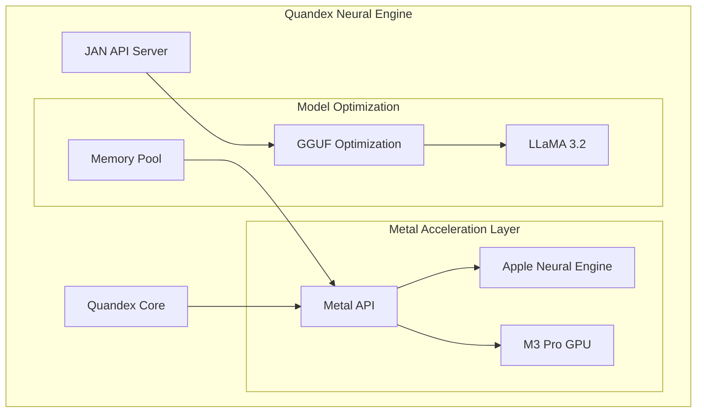

# Quandex Neural Engine Architecture

## System Overview



## Core Components

### 1. Quandex Neural Engine
The Quandex Neural Engine is a high-performance neural processing system optimized for Apple Silicon M3:

- **Metal Acceleration**: Direct integration with M3's Neural Engine
- **Model Optimization**: GGUF format optimization for LLaMA 3.2 and future models
- **Dynamic Memory Management**: Unified memory architecture optimization

### 2. JAN API Server
JSON Agentic Neural (JAN) server provides the interface for model deployment and inference:

```python
class JANServer:
    def __init__(self):
        self.metal_device = MetalDevice()
        self.model_manager = GGUFModelManager()
        
    async def process_request(self, request):
        # Process through Metal-optimized pipeline
        return await self.model_manager.infer(
            request,
            accelerator=self.metal_device
        )
```

### 3. Metal Integration
Metal Performance Shaders (MPS) optimization for neural processing:

```metal
kernel void neural_process(
    device const half4* weights [[buffer(0)]],
    device const half4* input [[buffer(1)]],
    device half4* output [[buffer(2)]],
    uint thread_id [[thread_position_in_grid]]
) {
    // M3 Pro optimized processing
    half4 input_state = input[thread_id];
    output[thread_id] = mix(input_state, weights[thread_id], 0.5h);
}
```

## Model Support

### 1. LLaMA 3.2 Integration
- Metal-optimized inference
- Dynamic batch processing
- Adaptive memory management

### 2. Future Model Support
- Mistral AI models
- Claude 3
- GPT-4 Turbo
- Custom fine-tuned models

## Performance Optimization

### 1. Memory Management
- Unified memory pool for M3 Pro
- Dynamic tensor allocation
- Smart caching system

### 2. Neural Processing
- Metal shader optimization
- Batch size adaptation
- Resource monitoring

### 3. Model Deployment
- GGUF optimization
- Metal acceleration
- Dynamic quantization

## Deployment Architecture

### 1. Local Deployment
```bash
# Start Quandex Engine
quandex start --metal-optimize

# Launch JAN API Server
jan-server --model llama3.2 --metal-device
```

### 2. Model Configuration
```yaml
model_config:
  name: "llama-3.2"
  type: "gguf"
  metal_threads: 4
  batch_size: 32
  memory_limit: "24GB"
```

### 3. API Integration
```python
from quandex.client import QuandexClient

client = QuandexClient()
response = await client.generate(
    model="llama-3.2",
    prompt="Implement a neural network",
    metal_optimize=True
)
