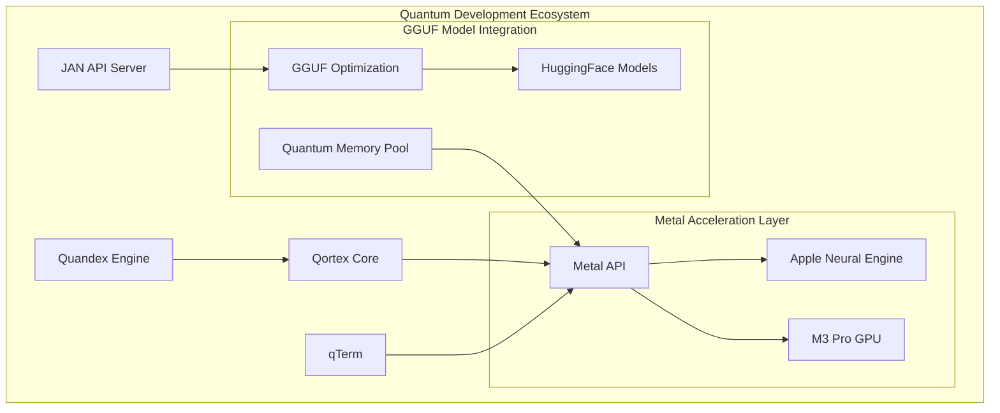

# Quantum Development Ecosystem

```
┌─────────────────────────────────────────────┐
│              Quandex Engine                 │
│  ┌─────────────┐         ┌──────────────┐  │
│  │   Qortex    │◀──────▶│   JAN API    │  │
│  │(Quantum Core)│         │   Server    │  │
│  └─────────────┘         └──────────────┘  │
└───────────────────┬─────────────────────────┘
                    │
        ┌───────────▼───────────┐
        │        qTerm          │
        │  Swift Metal UI/IDE   │
        └─────────────────────┘
```

## System Components

### 1. Quandex Engine
The quantum-inspired development engine that powers the entire ecosystem:

- **Quantum State Management**: Handles parallel development states
- **Neural Processing**: M3-optimized language models
- **Resource Orchestration**: Dynamic resource allocation

### 2. Qortex (Quantum Core)
Neural processing core implementing quantum computing paradigms:

```swift
// Quantum Circuit Example
struct QuantumCircuit {
    let metalDevice: MTLDevice
    var qubits: [MetalQubit]
    
    func applySuperposition() {
        metalCompute.hadamardGate(qubits)
    }
    
    func measureState() -> Float {
        metalCompute.quantumMeasurement(qubits)
    }
}
```

### 3. JAN API Server
JSON Agentic Neural server for distributed quantum processing:

```python
class JANServer:
    def __init__(self):
        self.quantum_state = QuantumState()
        self.metal_accelerator = MetalAccelerator()
        
    async def process_quantum_request(self, request):
        # Process through quantum circuits
        quantum_result = await self.quantum_state.process(
            request, 
            accelerator=self.metal_accelerator
        )
        return quantum_result
```

### 4. qTerm (Swift Metal IDE)
Generative IDE/terminal environment with quantum-inspired UI:

```swift
struct QTerminal {
    // Metal shader for quantum visualization
    let quantumShader = """
    #include <metal_stdlib>
    using namespace metal;
    
    kernel void quantumVisualize(
        texture2d<float, access::write> output,
        device const float* quantumStates,
        uint2 gid [[thread_position_in_grid]]
    ) {
        // Visualize quantum states using interference patterns
        float state = quantumStates[gid.x];
        float4 color = float4(state, 1.0 - state, 0.5, 1.0);
        output.write(color, gid);
    }
    """
}
```

## MacOS Sequoia Runtime Integration



### Enhanced Metal Integration

```metal
// Quantum Memory Management
struct QuantumMemoryPool {
    threadgroup Complex states[THREAD_GROUP_SIZE];
    device float4x4* gates;
    device atomic_uint* ref_count;
};

// Neural Quantum Processing
kernel void neural_quantum_process(
    constant QuantumMemoryPool& pool,
    device const float4* input,
    device float4* output,
    uint index [[thread_position_in_grid]]
) {
    // M3 Pro optimized processing
    half4 quantum_state = half4(input[index]);
    quantum_state = metal::mix(quantum_state, 
                             pool.gates[index].columns[0], 
                             half(0.5));
    output[index] = float4(quantum_state);
}
```

### Langchain Quantic Workflows

```python
class QuanticWorkflow:
    def __init__(self):
        self.metal_device = MetalDevice()
        self.quantum_memory = QuantumMemoryPool()
        self.gguf_models = GGUFModelManager()
    
    async def process_quantum_chain(self, input_state):
        # Quantum-enhanced language processing
        quantum_state = await self.quantum_memory.prepare_state(input_state)
        
        # Metal-accelerated model inference
        with self.metal_device.scope():
            model_output = self.gguf_models.process(
                quantum_state,
                accelerator=self.metal_device
            )
        
        return model_output

class JanAPIServer:
    def __init__(self):
        self.quantic_workflow = QuanticWorkflow()
        self.metal_compute = MetalComputeEngine()
    
    async def handle_request(self, request):
        # Process through quantum-enhanced pipeline
        quantum_result = await self.quantic_workflow.process_quantum_chain(
            request.input_state
        )
        
        # Apply quantum measurement
        measured_state = self.metal_compute.measure_quantum_state(
            quantum_result
        )
        
        return measured_state
```

### Cortex Integration Layer

```swift
struct CortexLayer {
    let metalDevice: MTLDevice
    var quantumMemory: QuantumMemoryPool
    
    func processQuantumState(_ state: QuantumState) -> QuantumResult {
        // Optimize for M3 Pro using Metal
        let commandQueue = metalDevice.makeCommandQueue()
        let commandBuffer = commandQueue?.makeCommandBuffer()
        
        // Configure compute pipeline
        let computePipelineState = try! metalDevice.makeComputePipelineState(
            function: "neural_quantum_process"
        )
        
        // Execute quantum computation
        let computeEncoder = commandBuffer?.makeComputeCommandEncoder()
        computeEncoder?.setComputePipelineState(computePipelineState)
        computeEncoder?.dispatchThreadgroups(/*...*/)
        
        return quantumResult
    }
}
```

## Key Features

### 1. Quantum-Inspired Processing
- **Parallel States**: Multiple code versions exist simultaneously
- **Quantum Measurement**: Probabilistic decision making
- **State Entanglement**: Correlated development paths

### 2. Metal Optimization
- **Custom Shaders**: Quantum state visualization
- **Neural Acceleration**: M3-optimized processing
- **Memory Management**: Unified memory architecture

### 3. Generative Development
- **AI Assistance**: LLM integration through quantum circuits
- **Code Generation**: Parallel path exploration
- **Intelligent Refactoring**: Quantum-inspired optimization

## Implementation Details

### Quantum State Representation
```swift
struct MetalQubit {
    var amplitude: simd_float2  // Real and imaginary components
    var phase: Float
    
    func superposition() -> [Float] {
        // Create quantum superposition using Metal
        return metalDevice.createSuperposition(self)
    }
}
```

### Neural Processing
```python
class QuantumNeuralProcessor:
    def __init__(self):
        self.metal = MetalAccelerator()
        self.quantum_memory = QuantumMemory()
        
    async def process_parallel_states(self, states):
        # Process multiple states through quantum circuits
        return await self.metal.quantum_process(states)
```

### Metal Shader Integration
```metal
kernel void quantumProcess(
    device const float* input [[buffer(0)]],
    device float* output [[buffer(1)]],
    uint id [[thread_position_in_grid]]
) {
    // Quantum-inspired processing
    float state = input[id];
    output[id] = quantum_transform(state);
}
```

## Development Workflow

1. **State Initialization**
   - Create quantum development environment
   - Initialize Metal compute resources
   - Set up parallel processing pipelines

2. **Parallel Processing**
   - Generate multiple development paths
   - Process through quantum circuits
   - Measure optimal solutions

3. **Neural Enhancement**
   - LLM integration through quantum states
   - Metal-accelerated processing
   - Dynamic optimization

## Future Expansion Points

1. **Quantum Model Integration**
   - Custom GGUF format optimizations
   - Quantum-inspired model architectures
   - Metal shader specialization

2. **Memory Management**
   - Unified quantum memory pool
   - Dynamic state allocation
   - Thread group optimization

3. **Neural Enhancement**
   - Advanced quantum circuits
   - Metal compute kernel optimization
   - Dynamic model loading

## Future Enhancements

1. **Quantum Optimization**
   - Enhanced parallel processing
   - More sophisticated quantum circuits
   - Advanced state entanglement

2. **Metal Performance**
   - Custom neural operations
   - Advanced shader optimizations
   - Improved memory management

3. **AI Integration**
   - Advanced LLM integration
   - Quantum-inspired learning
   - Enhanced code generation
