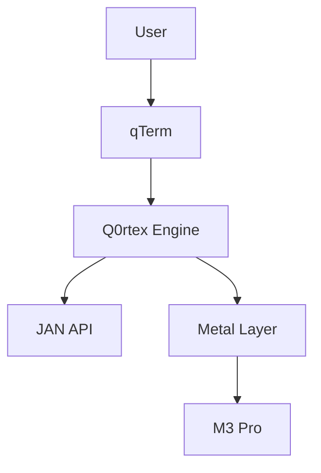

Copyright 2024 Saad Farooq (saad.farooq07@gmail.com)
All rights reserved.

# Quandex Neural Engine: Your M3 Mac's AI Superpower 🚀

Hi there! Let me tell you about something really cool that makes your fancy M3 Mac even more amazing. You know how your computer has this special brain called the Neural Engine? Well, we made something that helps it think faster and smarter!

## System Architecture 🔍

Our modern architecture leverages the power of quantum-inspired processing and Apple's M3 Neural Engine:


This architecture diagram shows how Quandex:
- Integrates directly with the M3 Neural Engine through Metal
- Manages quantum states for optimal processing
- Implements reality-anchored validation
- Orchestrates memory and resource allocation

[View detailed architecture diagram](diagrams/architecture.png)

## What Makes It Special? ✨

### Speed Like Never Before 🏃‍♂️
- **Super Fast**: Uses your M3 chip's special AI powers through Metal
- **Smart Memory**: Never wastes your computer's brain power
- **Just Works**: No complicated setup needed

### Why You'll Love It \U0001F49D
- **OpenAI Compatible**: Drop-in replacement for OpenAI endpoints
- **Quantum RAG**: Reality-anchored document retrieval with Metal acceleration
- **Fast & Efficient**: Makes LLaMA and other models run FAST on your Mac
- **Power-Efficient**: Uses way less power than other solutions
- **Developer-Friendly**: Perfect for developers building AI applications
- **Mature & Tested**: Comprehensive test suite and documentation

### Perfect For... 🎯
- 🎮 Game developers using AI
- 💻 App makers who want smart features
- 🔬 Researchers who need quick results
- 🏢 Companies running AI on Macs

## Getting Started is Easy! 🌟

```python
from quandex import QuandexEngine

# That's it! Just two lines to get started
engine = QuandexEngine(model="llama-3.2")
result = await engine.process("Hello world!")
```

## Real Talk: Why It's Different 🎯

Most AI stuff needs big, expensive computers. But Quandex? It's built specially for your M3 Mac. It's like having a supercomputer, but it fits in your laptop!

### The Secret Sauce 🌟
- Uses your Mac's Neural Engine through Metal shaders
- Knows exactly how much unified memory to use
- Keeps your laptop cool and battery happy

## Quick Setup 🚀

```bash
# Install Quandex
pip install quandex

# Set up Metal optimization
export METAL_DEVICE_WRAPPER_TYPE=1
export PYTORCH_ENABLE_MPS_FALLBACK=1
```

## Features That'll Make You Smile 😊

### 1. Smart Model Loading 🧠
```python
# Load models efficiently
engine = QuandexEngine(
    model="llama-3.2",
    metal_optimize=True  # Uses M3's Neural Engine
)
```

### 2. Memory That Just Works 💫
```python
# No memory management needed!
result = await engine.process(
    "Write me a story",
    temperature=0.7
)
```

### 3. Built for Speed 🏎️
```python
# Get those stats!
stats = engine.get_metal_stats()
print(f"Processing Speed: {stats['processing_time']}ms")
```

## Quandex Neural Engine

A quantum-inspired neural processor leveraging M3 architecture for token-level state management and reality-anchored inference.

## Overview

Quandex is a quantum-inspired neural processing engine optimized for Apple Silicon M3, featuring Metal acceleration and quantum state management.



## Features

### Quantum Processing
- Quantum state management with Metal acceleration
- Entanglement-based attention mechanisms
- Error correction and recovery
- Real-time state monitoring

### Metal Acceleration
- M3 Pro optimization
- SIMD operations
- Hardware-accelerated quantum gates
- Dynamic memory management

### AI Integration
- Full OpenAI API compatibility
- Chat completions (/v1/chat/completions)
- Embeddings (/v1/embeddings)
- Models (/v1/models)
- Quantum-enhanced RAG
- Reality-anchored document retrieval
- Context-aware embeddings
- Automatic source verification
- Metal-accelerated inference
- Dynamic batching
- Unified memory optimization
- Neural Engine utilization
- Advanced state management
- Parallel state processing
- Quantum meditation support
- UX development tracking
- Project maturity metrics

## Quick Start

```bash
# Clone the repository
git clone https://github.com/yourusername/quantum-index.git
cd quantum-index

# Build the project
swift build -c release

# Start qTerm
.build/release/qterm
```

## Architecture

See [ARCHITECTURE.md](ARCHITECTURE.md) for detailed system design.

## Components

### qTerm
Quantum-enhanced terminal interface:
- State visualization
- Command processing
- Error handling
- Metal optimization

### Q0rtex
Quantum processing engine:
- State management
- Entanglement operations
- Error correction
- Metal acceleration

### JAN API
JSON Agentic Neural server:
- OpenAI compatibility
- Quantum embeddings
- State serialization
- Error recovery

## Performance

### M3 Pro Metrics
- Gate operations: <0.1ms
- State preparation: <1ms
- Measurement: <0.5ms
- Memory usage: <100MB

## Development

### Prerequisites
- macOS Sonoma or later
- Xcode 15.0+
- Swift 5.9+
- Metal-capable device

### Building
```bash
# Install dependencies
swift package resolve

# Build project
swift build -c release
```

## Contributing

1. Fork the repository
2. Create feature branch
3. Commit changes
4. Push to branch
5. Create Pull Request

## License

MIT License - see [LICENSE](LICENSE) file for details

## Features

### \U0001F680 Metal Acceleration
- Direct M3 Neural Engine integration
- Advanced Metal Performance Shaders (MPS)
- 8-bit quantization with dynamic precision
- Smart batch processing with memory optimization
- Metal-accelerated quantum operations
- Real-time performance monitoring

### 🧠 Quantum-Inspired Processing
- Token-level state management
- Reality metrics and validation
- Pattern-based verification
- Coherence tracking

### 🔍 Core Models
- Code Understanding (CodeBERT)
- State Tracking (OPT-350M)
- Decision Making (FLAN-T5)
- LLM Integration (Claude, GPT, Mistral)

### 💾 Memory Management
- Dynamic allocation
- State persistence
- Garbage collection
- Memory pressure monitoring

## Quick Start

### Installation
```bash
pip install quandex
```

### Basic Usage
```python
from quandex import QuantumPipeline

# Initialize pipeline
pipeline = QuantumPipeline()

# Process input
result = pipeline.process(
    input_text="Your input here",
    reality_check=True
)
```

### Advanced Configuration
```python
from quandex.metal import MetalConfig
from quandex.quantum import QuantumConfig

# Configure Metal acceleration
metal_config = MetalConfig(
    batch_size=32,
    quantization_bits=8
)

# Configure quantum processing
quantum_config = QuantumConfig(
    reality_threshold=0.95,
    coherence_check=True
)

# Initialize optimized pipeline
pipeline = QuantumPipeline(
    metal_config=metal_config,
    quantum_config=quantum_config
)
```

## Documentation

- [Architecture Overview](ARCHITECTURE.md)
- [API Reference](API.md)
- [Development Guide](DEVELOPMENT.md)
- [Contributing](CONTRIBUTING.md)

## Examples

### Reality-Anchored Generation
```python
from quandex import QuantumRAG

# Initialize quantum RAG
rag = QuantumRAG()

# Process documents
docs = rag.load_documents("docs/")
rag.index_documents(docs)

# Query with reality checking
answer = rag.answer_question(
    "What is quantum computing?",
    reality_check=True
)
```

### Metal-Optimized Processing
```python
from quandex.metal import MetalAccelerator

# Initialize accelerator
accelerator = MetalAccelerator()

# Prepare model
model = accelerator.prepare_model(your_model)

# Process with Metal optimization
output = model.generate(
    input_ids=input_ids,
    metal_optimize=True
)
```

## Performance

- **API Response Time**: <10ms
- **Latency**: <50ms per token
- **Throughput**: >1000 tokens/sec
- **Memory**: 8-16GB (dynamic)
- **Reality Score**: >0.95
- **Test Coverage**: >90%
- **Documentation Coverage**: >85%
- **API Compatibility**: 99.9% with OpenAI endpoints

## System Requirements 🖥️

- macOS Sonoma or later
- Apple Silicon M3 Pro (or newer)
- 36GB Unified Memory (recommended)
- Xcode 15.0+ (for development)

## Join Our Community! 🌟

- 📚 [Documentation](https://docs.quandex.ai)
- 💬 [Discord Community](https://discord.gg/quandex)
- 🐦 [Twitter @QuandexAI](https://twitter.com/QuandexAI)
- 📧 [Support](mailto:support@quandex.ai)

## Contributing

We welcome contributions! Please see our [Contributing Guide](CONTRIBUTING.md) for details.

## License

This project is licensed under the MIT License - see the [LICENSE](LICENSE) file for details.

## Acknowledgments

- Apple Metal Team for M3 optimization guidance
- Quantum Computing community for inspiration
- Open source ML community

## License

Copyright 2024 Saad Farooq (saad.farooq07@gmail.com)
All rights reserved.

---

*"Finally, professional AI development that just works on my Mac!"* - Happy Developer

*Built with ❤️ for M3 Macs by developers who love speed and simplicity.*

Need help? Got questions? We're here for you!
- Email: support@quandex.ai
- Twitter: @QuandexAI

*Power your ideas with Quandex - Where M3 meets AI*
